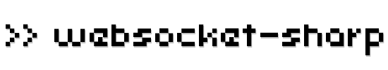

## Welcome to websocket-sharp! ##

websocket-sharp supports:

- [RFC 6455](#supported-websocket-specifications)
- [WebSocket Client](#websocket-client) and [Server](#websocket-server)
- [Per-message Compression](#per-message-compression) extension
- [Secure Connection](#secure-connection)
- [HTTP Authentication](#http-authentication)
- [Query string, Origin header, and Cookies](#query-string-origin-header-and-cookies)
- [Connecting through the HTTP proxy server](#connecting-through-the-http-proxy-server)
- .NET Framework **3.5** or later (includes compatible environment such as [Mono])

## Branches ##

- [master] for production releases.
- [hybi-00] for older [draft-ietf-hybi-thewebsocketprotocol-00]. No longer maintained.
- [draft75] for even more old [draft-hixie-thewebsocketprotocol-75]. No longer maintained.

## Build ##

websocket-sharp is built as a single assembly, **websocket-sharp.dll**.

websocket-sharp is developed with [MonoDevelop]. So a simple way to build is to open **websocket-sharp.sln** and run build for **websocket-sharp project** with any of the build configurations (e.g. `Debug`) in MonoDevelop.

## Install ##

### Self Build ###

You should add your websocket-sharp.dll (e.g. `/path/to/websocket-sharp/bin/Debug/websocket-sharp.dll`) to the library references of your project.

If you would like to use that dll in your [Unity] project, you should add it to any folder of your project (e.g. `Assets/Plugins`) in the **Unity Editor**.

### NuGet Gallery ###

websocket-sharp is available on the [NuGet Gallery], as still a **prerelease** version.

- [NuGet Gallery: websocket-sharp]

You can add websocket-sharp to your project with the NuGet Package Manager, by using the following command in the Package Manager Console.

    PM> Install-Package WebSocketSharp -Pre

### Unity Asset Store ###

websocket-sharp is available on the Unity Asset Store (Sorry, Not available now).

- [WebSocket-Sharp for Unity]

It works with **Unity Free**, but there are some limitations:

- [Security Sandbox of the Webplayer] (The server is not available in Web Player)
- [WebGL Networking] (Not available in WebGL)
- Incompatible platform (Not available for such UWP)
- Lack of dll for the System.IO.Compression (The compression extension is not available on Windows)
- .NET Socket Support for iOS/Android (iOS/Android Pro is required if your Unity is earlier than Unity 5)
- .NET API 2.0 compatibility level for iOS/Android

.NET API 2.0 compatibility level for iOS/Android may require to fix lack of some features for later than .NET Framework 2.0, such as the `System.Func<...>` delegates (so i have added them in the asset package).

And it is priced at **US$15**. I believe your $15 makes this project more better, **Thank you!**

## Usage ##

### WebSocket Client ###

```csharp
using System;
using WebSocketSharp;

namespace Example
{
  public class Program
  {
    public static void Main (string[] args)
    {
      using (var ws = new WebSocket ("ws://dragonsnest.far/Laputa")) {
        ws.OnMessage += (sender, e) =>
            Console.WriteLine ("Laputa says: " + e.Data);

        ws.Connect ();
        ws.Send ("BALUS");
        Console.ReadKey (true);
      }
    }
  }
}
```

#### Step 1 ####

Required namespace.

```csharp
using WebSocketSharp;
```

The `WebSocket` class exists in the `WebSocketSharp` namespace.

#### Step 2 ####

Creating a new instance of the `WebSocket` class with the WebSocket URL to connect.

```csharp
var ws = new WebSocket ("ws://example.com");
```

The `WebSocket` class inherits the `System.IDisposable` interface, so you can create it with the `using` statement.

```csharp
using (var ws = new WebSocket ("ws://example.com")) {
  ...
}
```

This will **close** the WebSocket connection with status code `1001` (going away) when the control leaves the `using` block.

#### Step 3 ####

Setting the `WebSocket` events.

##### WebSocket.OnOpen Event #####

This event occurs when the WebSocket connection has been established.

```csharp
ws.OnOpen += (sender, e) => {
    ...
  };
```

`System.EventArgs.Empty` is passed as `e`, so you do not need to use it.

##### WebSocket.OnMessage Event #####

This event occurs when the `WebSocket` receives a message.

```csharp
ws.OnMessage += (sender, e) => {
    ...
  };
```

A `WebSocketSharp.MessageEventArgs` instance is passed as `e`.

If you would like to get the message data, you should access `e.Data` or `e.RawData` property.

`e.Data` property returns a `string`, so it is mainly used to get the **text** message data.

`e.RawData` property returns a `byte[]`, so it is mainly used to get the **binary** message data.

```csharp
if (e.IsText) {
  // Do something with e.Data.
  ...

  return;
}

if (e.IsBinary) {
  // Do something with e.RawData.
  ...

  return;
}
```

And if you would like to notify that a **ping** has been received, via this event, you should set the `WebSocket.EmitOnPing` property to `true`.

```csharp
ws.EmitOnPing = true;
ws.OnMessage += (sender, e) => {
    if (e.IsPing) {
      // Do something to notify that a ping has been received.
      ...

      return;
    }
  };
```

##### WebSocket.OnError Event #####

This event occurs when the `WebSocket` gets an error.

```csharp
ws.OnError += (sender, e) => {
    ...
  };
```

A `WebSocketSharp.ErrorEventArgs` instance is passed as `e`.

If you would like to get the error message, you should access `e.Message` property.

`e.Message` property returns a `string` that represents the error message.

And `e.Exception` property returns a `System.Exception` instance that represents the cause of the error if it is due to an exception.

##### WebSocket.OnClose Event #####

This event occurs when the WebSocket connection has been closed.

```csharp
ws.OnClose += (sender, e) => {
    ...
  };
```

A `WebSocketSharp.CloseEventArgs` instance is passed as `e`.

If you would like to get the reason for the close, you should access `e.Code` or `e.Reason` property.

`e.Code` property returns a `ushort` that represents the status code for the close.

`e.Reason` property returns a `string` that represents the reason for the close.

#### Step 4 ####

Connecting to the WebSocket server.

```csharp
ws.Connect ();
```

If you would like to connect to the server asynchronously, you should use the `WebSocket.ConnectAsync ()` method.

#### Step 5 ####

Sending data to the WebSocket server.

```csharp
ws.Send (data);
```

The `WebSocket.Send` method is overloaded.

You can use the `WebSocket.Send (string)`, `WebSocket.Send (byte[])`, or `WebSocket.Send (System.IO.FileInfo)` method to send the data.

If you would like to send the data asynchronously, you should use the `WebSocket.SendAsync` method.

```csharp
ws.SendAsync (data, completed);
```

And also if you would like to do something when the send is complete, you should set `completed` to any `Action<bool>` delegate.

#### Step 6 ####

Closing the WebSocket connection.

```csharp
ws.Close (code, reason);
```

If you would like to close the connection explicitly, you should use the `WebSocket.Close` method.

The `WebSocket.Close` method is overloaded.

You can use the `WebSocket.Close ()`, `WebSocket.Close (ushort)`, `WebSocket.Close (WebSocketSharp.CloseStatusCode)`, `WebSocket.Close (ushort, string)`, or `WebSocket.Close (WebSocketSharp.CloseStatusCode, string)` method to close the connection.

If you would like to close the connection asynchronously, you should use the `WebSocket.CloseAsync` method.

### WebSocket Server ###

```csharp
using System;
using WebSocketSharp;
using WebSocketSharp.Server;

namespace Example
{
  public class Laputa : WebSocketBehavior
  {
    protected override void OnMessage (MessageEventArgs e)
    {
      var msg = e.Data == "BALUS"
                ? "I've been balused already..."
                : "I'm not available now.";

      Send (msg);
    }
  }

  public class Program
  {
    public static void Main (string[] args)
    {
      var wssv = new WebSocketServer ("ws://dragonsnest.far");
      wssv.AddWebSocketService<Laputa> ("/Laputa");
      wssv.Start ();
      Console.ReadKey (true);
      wssv.Stop ();
    }
  }
}
```

#### Step 1 ####

Required namespace.

```csharp
using WebSocketSharp.Server;
```

The `WebSocketBehavior` and `WebSocketServer` classes exist in the `WebSocketSharp.Server` namespace.

#### Step 2 ####

Creating the class that inherits the `WebSocketBehavior` class.

For example, if you would like to provide an echo service,

```csharp
using System;
using WebSocketSharp;
using WebSocketSharp.Server;

public class Echo : WebSocketBehavior
{
  protected override void OnMessage (MessageEventArgs e)
  {
    Send (e.Data);
  }
}
```

And if you would like to provide a chat service,

```csharp
using System;
using WebSocketSharp;
using WebSocketSharp.Server;

public class Chat : WebSocketBehavior
{
  private string _suffix;

  public Chat ()
    : this (null)
  {
  }

  public Chat (string suffix)
  {
    _suffix = suffix ?? String.Empty;
  }

  protected override void OnMessage (MessageEventArgs e)
  {
    Sessions.Broadcast (e.Data + _suffix);
  }
}
```

You can define the behavior of any WebSocket service by creating the class that inherits the `WebSocketBehavior` class.

If you override the `WebSocketBehavior.OnMessage (MessageEventArgs)` method, it will be called when the `WebSocket` used in a session in the service receives a message.

And if you override the `WebSocketBehavior.OnOpen ()`, `WebSocketBehavior.OnError (ErrorEventArgs)`, and `WebSocketBehavior.OnClose (CloseEventArgs)` methods, each of them will be called when each of the `WebSocket` events (`OnOpen`, `OnError`, and `OnClose`) occurs.

The `WebSocketBehavior.Send` method can send data to the client on a session in the service.

If you would like to get the sessions in the service, you should access the `WebSocketBehavior.Sessions` property (returns a `WebSocketSharp.Server.WebSocketSessionManager`).

The `WebSocketBehavior.Sessions.Broadcast` method can send data to every client in the service.

#### Step 3 ####

Creating a new instance of the `WebSocketServer` class.

```csharp
var wssv = new WebSocketServer (4649);
wssv.AddWebSocketService<Echo> ("/Echo");
wssv.AddWebSocketService<Chat> ("/Chat");
wssv.AddWebSocketService<Chat> ("/ChatWithNyan", () => new Chat (" Nyan!"));
```

You can add any WebSocket service to your `WebSocketServer` with the specified behavior and absolute path to the service, by using the `WebSocketServer.AddWebSocketService<TBehaviorWithNew> (string)` or `WebSocketServer.AddWebSocketService<TBehavior> (string, Func<TBehavior>)` method.

The type of `TBehaviorWithNew` must inherit the `WebSocketBehavior` class, and must have a public parameterless constructor.

The type of `TBehavior` must inherit the `WebSocketBehavior` class.

So you can use a class in the above Step 2 to add the service.

If you create a new instance of the `WebSocketServer` class without a port number, it sets the port number to **80**. So it is necessary to run with root permission.

    $ sudo mono example2.exe

#### Step 4 ####

Starting the WebSocket server.

```csharp
wssv.Start ();
```

#### Step 5 ####

Stopping the WebSocket server.

```csharp
wssv.Stop (code, reason);
```

The `WebSocketServer.Stop` method is overloaded.

You can use the `WebSocketServer.Stop ()`, `WebSocketServer.Stop (ushort, string)`, or `WebSocketServer.Stop (WebSocketSharp.CloseStatusCode, string)` method to stop the server.

### HTTP Server with the WebSocket ###

I have modified the `System.Net.HttpListener`, `System.Net.HttpListenerContext`, and some other classes from **[Mono]** to create an HTTP server that allows to accept the WebSocket handshake requests.

So websocket-sharp provides the `WebSocketSharp.Server.HttpServer` class.

You can add any WebSocket service to your `HttpServer` with the specified behavior and path to the service, by using the `HttpServer.AddWebSocketService<TBehaviorWithNew> (string)` or `HttpServer.AddWebSocketService<TBehavior> (string, Func<TBehavior>)` method.

```csharp
var httpsv = new HttpServer (4649);
httpsv.AddWebSocketService<Echo> ("/Echo");
httpsv.AddWebSocketService<Chat> ("/Chat");
httpsv.AddWebSocketService<Chat> ("/ChatWithNyan", () => new Chat (" Nyan!"));
```

For more information, would you see **[Example3]**?

### WebSocket Extensions ###

#### Per-message Compression ####

websocket-sharp supports the [Per-message Compression][compression] extension (but does not support it with the [context take over]).

As a WebSocket client, if you would like to enable this extension, you should set the `WebSocket.Compression` property to a compression method before calling the connect method.

```csharp
ws.Compression = CompressionMethod.Deflate;
```

And then the client will send the following header in the handshake request to the server.

    Sec-WebSocket-Extensions: permessage-deflate; server_no_context_takeover; client_no_context_takeover

If the server supports this extension, it will return the same header which has the corresponding value.

So eventually this extension will be available when the client receives the header in the handshake response.

#### Ignoring the extensions ####

As a WebSocket server, if you would like to ignore the extensions requested from a client, you should set the `WebSocketBehavior.IgnoreExtensions` property to `true` in your `WebSocketBehavior` constructor or initializing it, such as the following.

```csharp
wssv.AddWebSocketService<Chat> (
  "/Chat",
  () =>
    new Chat () {
      // To ignore the extensions requested from a client.
      IgnoreExtensions = true
    }
);
```

If it is set to `true`, the service will not return the Sec-WebSocket-Extensions header in its handshake response.

I think this is useful when you get something error in connecting the server and exclude the extensions as a cause of the error.

### Secure Connection ###

websocket-sharp supports the secure connection with **SSL/TLS**.

As a WebSocket client, you should create a new instance of the `WebSocket` class with a **wss** scheme WebSocket URL.

```csharp
var ws = new WebSocket ("wss://example.com");
```

If you would like to set a custom validation for the server certificate, you should set the `WebSocket.SslConfiguration.ServerCertificateValidationCallback` property to a callback for it.

```csharp
ws.SslConfiguration.ServerCertificateValidationCallback =
  (sender, certificate, chain, sslPolicyErrors) => {
    // Do something to validate the server certificate.
    ...

    return true; // If the server certificate is valid.
  };
```

The default callback always returns `true`.

As a WebSocket server, you should create a new instance of the `WebSocketServer` or `HttpServer` class with some settings for the secure connection, such as the following.

```csharp
var wssv = new WebSocketServer (5963, true);
wssv.SslConfiguration.ServerCertificate =
  new X509Certificate2 ("/path/to/cert.pfx", "password for cert.pfx");
```

### HTTP Authentication ###

websocket-sharp supports the [HTTP Authentication (Basic/Digest)][rfc2617].

As a WebSocket client, you should set a pair of user name and password for the HTTP authentication, by using the `WebSocket.SetCredentials (string, string, bool)` method before calling the connect method.

```csharp
ws.SetCredentials ("nobita", "password", preAuth);
```

If `preAuth` is `true`, the client will send the credentials for the Basic authentication in the first handshake request to the server.

Otherwise, it will send the credentials for either the Basic or Digest (determined by the unauthorized response to the first handshake request) authentication in the second handshake request to the server.

As a WebSocket server, you should set an HTTP authentication scheme, a realm, and any function to find the user credentials before calling the start method, such as the following.

```csharp
wssv.AuthenticationSchemes = AuthenticationSchemes.Basic;
wssv.Realm = "WebSocket Test";
wssv.UserCredentialsFinder = id => {
    var name = id.Name;

    // Return user name, password, and roles.
    return name == "nobita"
           ? new NetworkCredential (name, "password", "gunfighter")
           : null; // If the user credentials are not found.
  };
```

If you would like to provide the Digest authentication, you should set such as the following.

```csharp
wssv.AuthenticationSchemes = AuthenticationSchemes.Digest;
```

### Query string, Origin header, and Cookies ###

As a WebSocket client, if you would like to send the query string in the handshake request, you should create a new instance of the `WebSocket` class with a WebSocket URL that includes the [Query] string parameters.

```csharp
var ws = new WebSocket ("ws://example.com/?name=nobita");
```

If you would like to send the Origin header in the handshake request, you should set the `WebSocket.Origin` property to an allowable value as the [Origin] header before calling the connect method.

```csharp
ws.Origin = "http://example.com";
```

And if you would like to send the cookies in the handshake request, you should set any cookie by using the `WebSocket.SetCookie (WebSocketSharp.Net.Cookie)` method before calling the connect method.

```csharp
ws.SetCookie (new Cookie ("name", "nobita"));
```

As a WebSocket server, if you would like to get the query string included in a handshake request, you should access the `WebSocketBehavior.Context.QueryString` property, such as the following.

```csharp
public class Chat : WebSocketBehavior
{
  private string _name;
  ...

  protected override void OnOpen ()
  {
    _name = Context.QueryString["name"];
  }

  ...
}
```

If you would like to get the value of the Origin header included in a handshake request, you should access the `WebSocketBehavior.Context.Origin` property.

If you would like to get the cookies included in a handshake request, you should access the `WebSocketBehavior.Context.CookieCollection` property.

And if you would like to validate the Origin header, cookies, or both, you should set each validation for it with your `WebSocketBehavior`, for example, by using the `WebSocketServer.AddWebSocketService<TBehavior> (string, Func<TBehavior>)` method with initializing, such as the following.

```csharp
wssv.AddWebSocketService<Chat> (
  "/Chat",
  () =>
    new Chat () {
      OriginValidator = val => {
          // Check the value of the Origin header, and return true if valid.
          Uri origin;
          return !val.IsNullOrEmpty ()
                 && Uri.TryCreate (val, UriKind.Absolute, out origin)
                 && origin.Host == "example.com";
        },
      CookiesValidator = (req, res) => {
          // Check the cookies in 'req', and set the cookies to send to
          // the client with 'res' if necessary.
          foreach (Cookie cookie in req) {
            cookie.Expired = true;
            res.Add (cookie);
          }

          return true; // If valid.
        }
    }
);
```

### Connecting through the HTTP proxy server ###

websocket-sharp supports to connect through the HTTP proxy server.

If you would like to connect to a WebSocket server through the HTTP proxy server, you should set the proxy server URL, and if necessary, a pair of user name and password for the proxy server authentication (Basic/Digest), by using the `WebSocket.SetProxy (string, string, string)` method before calling the connect method.

```csharp
var ws = new WebSocket ("ws://example.com");
ws.SetProxy ("http://localhost:3128", "nobita", "password");
```

I have tested this with **[Squid]**. It is necessary to disable the following option in **squid.conf** (e.g. `/etc/squid/squid.conf`).

```
# Deny CONNECT to other than SSL ports
#http_access deny CONNECT !SSL_ports
```

### Logging ###

The `WebSocket` class has the own logging function.

You can use it with the `WebSocket.Log` property (returns a `WebSocketSharp.Logger`).

So if you would like to change the current logging level (`WebSocketSharp.LogLevel.Error` as the default), you should set the `WebSocket.Log.Level` property to any of the `LogLevel` enum values.

```csharp
ws.Log.Level = LogLevel.Debug;
```

The above means a log with lower than `LogLevel.Debug` cannot be outputted.

And if you would like to output a log, you should use any of the output methods. The following outputs a log with `LogLevel.Debug`.

```csharp
ws.Log.Debug ("This is a debug message.");
```

The `WebSocketServer` and `HttpServer` classes have the same logging function.

## Examples ##

Examples using websocket-sharp.

### Example ###

[Example] connects to the [Echo server].

### Example2 ###

[Example2] starts a WebSocket server.

### Example3 ###

[Example3] starts an HTTP server that allows to accept the WebSocket handshake requests.

Would you access to [http://localhost:4649](http://localhost:4649) to do **WebSocket Echo Test** with your web browser while Example3 is running?

## Supported WebSocket Specifications ##

websocket-sharp supports **RFC 6455**, and it is based on the following references:

- [The WebSocket Protocol][rfc6455]
- [The WebSocket API][api]
- [Compression Extensions for WebSocket][compression]

Thanks for translating to japanese.

- [The WebSocket Protocol 日本語訳][rfc6455_ja]
- [The WebSocket API 日本語訳][api_ja]

## License ##

websocket-sharp is provided under [The MIT License].


[Echo server]: http://www.websocket.org/echo.html
[Example]: https://github.com/sta/websocket-sharp/tree/master/Example
[Example2]: https://github.com/sta/websocket-sharp/tree/master/Example2
[Example3]: https://github.com/sta/websocket-sharp/tree/master/Example3
[Mono]: http://www.mono-project.com
[MonoDevelop]: http://monodevelop.com
[NuGet Gallery]: http://www.nuget.org
[NuGet Gallery: websocket-sharp]: http://www.nuget.org/packages/WebSocketSharp
[Origin]: http://tools.ietf.org/html/rfc6454#section-7
[Query]: http://tools.ietf.org/html/rfc3986#section-3.4
[Security Sandbox of the Webplayer]: http://docs.unity3d.com/Manual/SecuritySandbox.html
[Squid]: http://www.squid-cache.org
[The MIT License]: https://raw.github.com/sta/websocket-sharp/master/LICENSE.txt
[Unity]: http://unity3d.com
[WebGL Networking]: http://docs.unity3d.com/Manual/webgl-networking.html
[WebSocket-Sharp for Unity]: http://u3d.as/content/sta-blockhead/websocket-sharp-for-unity
[api]: http://www.w3.org/TR/websockets
[api_ja]: http://www.hcn.zaq.ne.jp/___/WEB/WebSocket-ja.html
[compression]: http://tools.ietf.org/html/draft-ietf-hybi-permessage-compression-19
[context take over]: http://tools.ietf.org/html/draft-ietf-hybi-permessage-compression-19#section-8.1.1
[draft-hixie-thewebsocketprotocol-75]: http://tools.ietf.org/html/draft-hixie-thewebsocketprotocol-75
[draft-ietf-hybi-thewebsocketprotocol-00]: http://tools.ietf.org/html/draft-ietf-hybi-thewebsocketprotocol-00
[draft75]: https://github.com/sta/websocket-sharp/tree/draft75
[hybi-00]: https://github.com/sta/websocket-sharp/tree/hybi-00
[master]: https://github.com/sta/websocket-sharp/tree/master
[rfc2617]: http://tools.ietf.org/html/rfc2617
[rfc6455]: http://tools.ietf.org/html/rfc6455
[rfc6455_ja]: http://www.hcn.zaq.ne.jp/___/WEB/RFC6455-ja.html
